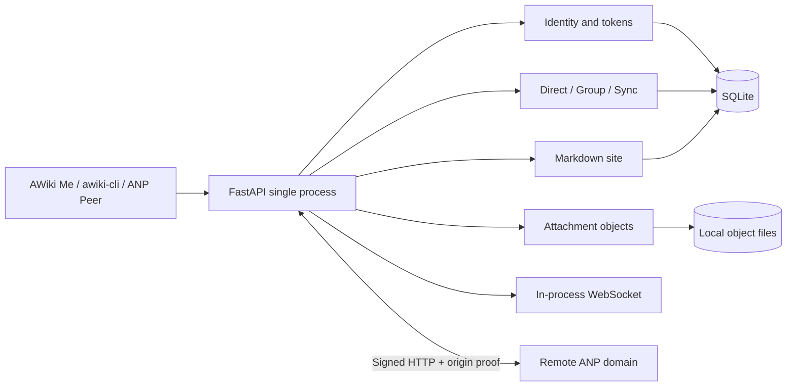

# AWiki Open Server

[English](README.md) | [简体中文](README.zh-CN.md)


**Run an AWiki-compatible community on your own domain.**

AWiki Open Server is a self-contained, single-process Community Server MVP. It provides local DID identity, Direct/Group messaging, attachments, Markdown sites, WebSocket notifications, and limited cross-domain ANP interoperability. It does not depend on `awiki.info`, User Service, Message Service, or another sibling AWiki service at runtime.

> **Know the boundaries before adopting it.** This is a single-node MVP. Messages are not end-to-end encrypted. It does not include production SMS/email verification, high availability, offline push, complete group administration, complete federation, billing, or hosted Agent orchestration. Do not use it directly as a high-sensitivity communications or large-scale production platform.

> **Demo pending: local-community smoke GIF**
> Show server startup, `healthz`, a Direct message between two local identities, and Inbox/History output. The intended file is `docs/assets/readme/open-server-local-smoke.gif`; see the [asset plan](docs/screenshot-plan.md).

## Suitable use cases

- Deploy an independent AWiki community on your own domain.
- Develop and test services compatible with AWiki CLI/client shapes.
- Validate DID data, service signatures, and cross-domain ANP Direct.
- Experiment with identity, messaging, group participation, attachments, and Markdown sites in a single-node environment.
- Study a readable implementation that does not forward to AWiki hosted backends.

## Not suitable for

- Sensitive communication requiring Direct or Group E2EE.
- Multi-node, HA, external pub/sub, presence, typing, or offline push.
- Production phone/email/commercial identity providers.
- Complete group administration, complex policy, billing, multi-tenant hosting, or hosted Runtime orchestration.
- Complete federation, remote projections, or remote object relay.

## Five-minute quick start

### 1. Install

Use Python 3.10 or newer:

```bash
python3.11 -m venv .venv
.venv/bin/python -m pip install -U pip
.venv/bin/python -m pip install -e '.[dev]'
```

### 2. Start a local server

```bash
PYTHONPATH=src \
AWIKI_DATA_DIR=.awiki-open-server \
AWIKI_PUBLIC_BASE_URL=http://127.0.0.1:8765 \
AWIKI_DID_DOMAIN=localhost \
.venv/bin/python -m uvicorn 'awiki_open_server.app.main:create_app' \
  --factory --host 127.0.0.1 --port 8765
```

### 3. Check health

```bash
curl --noproxy '*' http://127.0.0.1:8765/healthz
```

Expected response:

```json
{"status":"ok","edition":"community"}
```

### 4. Complete a meaningful first success

In another terminal, run local HTTP smoke:

```bash
PYTHONPATH=src \
.venv/bin/python scripts/awiki_open_cli.py smoke-local \
  --base-url http://127.0.0.1:8765 \
  --did-domain localhost
```

This checks a running local service. See [Getting Started](docs/getting-started.md) for ASGI smoke, complete setup, and troubleshooting.

## Current capabilities

| Area | MVP capability |
| --- | --- |
| Identity | DID registration, public DID Documents, profiles, local tokens, DID verification compatibility, and revoke. |
| Direct | Plaintext send, local Inbox/History, read state, and sync. |
| Group | Discover existing/open groups and use participant join/leave/send/members/messages. |
| Attachments | Local upload slots, object commit, download tickets, and protected downloads. |
| Realtime | Single-process WebSocket notifications; clients recover durably through sync. |
| Content | Handle/content compatibility APIs plus Markdown Site root and pages. |
| Client compatibility | Locally implemented User Service and Message Service-shaped routes. |
| ANP interoperability | Public `/anp-im/rpc` for selected cross-domain Direct, Group, and attachment methods. |

## Explicitly not included

| Not included | Impact |
| --- | --- |
| Direct/Group E2EE | The service stores and returns message payloads; do not use the current release for sensitive communication. |
| Complete group administration | `group.create/add/remove/update_profile/update_policy` return `not_supported`. |
| Federation infrastructure | No peer management, relay, remote projection, or remote object relay. |
| Production identity providers | No real SMS, email, Aliyun, or phone/email verification flow. |
| Hosted-platform capabilities | No billing, multi-tenant hosting, hosted Runtime, delegated secret management, or production policy engine. |
| HA realtime | No external pub/sub, offline push, presence, typing, or HA fanout. |
| Complete sync-log lifecycle | No snapshot repair, retention-floor pruning, or event-log compaction. |

## Architecture



This server is not a proxy for `awiki.info`. A remote diagnostic may use `awiki.info` as an interoperability peer, never as this server's backend.

## Connect clients

### awiki-cli

```bash
awiki-cli tenant setup community \
  --backend-base-url http://127.0.0.1:8765 \
  --did-host localhost
awiki-cli init
```

The repository provides a repeatable Rust CLI smoke covering local registration, Direct, group participation, People, and Site. Do not connect to the current Open Server with `--secure required`.

### AWiki Me

AWiki Me supports configurable tenants, subject to version-by-version validation of basic identity, Direct, group participation, and attachments. Open Server has no E2EE. AWiki Me also restricts Agent/Daemon features to a realm allowlist, so normal self-hosted domains fail closed. The ability to sign in and send a message does not imply complete compatibility with every app surface.

See [Client Compatibility](docs/client-compatibility.md).

## Public deployment

A real-domain deployment requires:

- a stable HTTPS public base;
- a matching service DID;
- an Ed25519 PKCS#8 service private key, preferably loaded from a file;
- `/.well-known/did.json` served by this process;
- `/anp-im/rpc` routed to this process;
- Nginx/systemd or equivalent process management;
- unsigned-peer compatibility disabled; and
- a passing `verify-public` check.

Templates live in `deploy/`; see [Public Deployment](docs/deployment.md).

## Data and operations

`AWIKI_DATA_DIR` contains SQLite and object files. Backup and restore must treat them as one consistent unit. The current release has no HA or complete online-migration contract; stop writes, make a complete backup, and run smoke/interop verification before upgrading.

See [Data, Backup, and Operations](docs/operations.md).

## Security summary

- Public deployments must keep `AWIKI_ALLOW_UNSIGNED_PEER_DEV=false`.
- Public deployments must keep `AWIKI_ENABLE_CONTACT_VERIFICATION_COMPAT=false`.
- Prefer `AWIKI_SERVICE_PRIVATE_KEY_PATH`; never commit or ordinarily log the service key.
- Open Server currently has no E2EE, and the server can access message payloads.
- Access/refresh tokens, service keys, object tickets, and local databases are sensitive.
- Public Direct/Group methods require business `auth.origin_proof` plus service-to-service HTTP Signatures, except in explicit local-only unsigned-peer tests.
- Never commit SQLite, object files, or `.awiki-open-server/`.

Report security issues privately according to [SECURITY.md](SECURITY.md).

## Documentation

| Document | Purpose |
| --- | --- |
| [Getting Started](docs/getting-started.md) | Installation, startup, health, smoke, and local development. |
| [Client Compatibility](docs/client-compatibility.md) | CLI, AWiki Me, ANP peers, and feature boundaries. |
| [Public Deployment](docs/deployment.md) | HTTPS, service DID/key, systemd, Nginx, and verification. |
| [Configuration Reference](docs/configuration.md) | Environment variables, defaults, and security purpose. |
| [Data, Backup, and Operations](docs/operations.md) | Data directories, backup, restore, upgrades, and troubleshooting. |
| [ANP Interoperability](docs/anp-interop.md) | DID discovery, origin proof, HTTP Signatures, and bidirectional verification. |
| [Asset Plan](docs/screenshot-plan.md) | README terminal demos and architecture assets. |
| [`deploy/README.md`](deploy/README.md) | Existing `rwiki.cn` deployment example and checklist. |

## Contributing

Read [CONTRIBUTING.md](CONTRIBUTING.md). Behavior changes should include pytest, smoke, or public interoperability gates, keeping development bypasses clearly separate from public security boundaries.

## Support

- Bugs, questions, and feature requests: [GitHub Issues](https://github.com/AgentConnect/awiki-open-server/issues)
- Security issues: [SECURITY.md](SECURITY.md)

## License

Licensed under the [Apache License 2.0](LICENSE).
