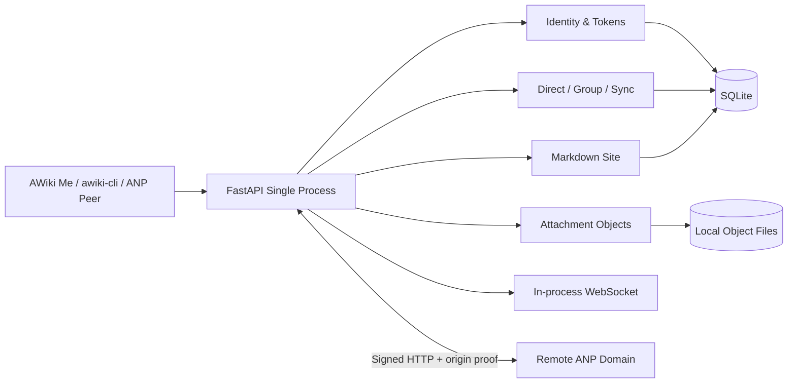

# AWiki Open Server

[English](README.md) | [简体中文](README.zh-CN.md)


**在自己的域名运行一个 AWiki 兼容社区。**

AWiki Open Server 是一个自包含、单进程的 Community Server MVP，提供本地 DID 身份、Direct/Group 消息、附件、Markdown 站点、WebSocket 通知，以及有限的跨域 ANP 互通。它不依赖 `awiki.info`、User Service、Message Service 或其他 AWiki 兄弟服务才能运行。

> **采用前必须知道：** 当前版本是单节点 MVP；消息不是端到端加密；不包含生产短信/邮件验证、高可用、离线推送、完整群管理、完整 federation、计费或托管 Agent 编排。不要把它直接当作敏感通信或大规模生产平台。

> **演示待补：本地社区 Smoke GIF**
> 建议展示启动服务、`healthz`、两个本地身份之间的 Direct 消息，以及 Inbox/History 结果。文件建议为 `docs/assets/readme/open-server-local-smoke.gif`。完整要求见 [截图计划](docs/screenshot-plan.zh-CN.md)。

## 适合什么场景

- 在自己的域名部署一个独立 AWiki 社区；
- 开发和测试 AWiki CLI / Client 的兼容服务；
- 验证 DID discovery、服务签名和跨域 ANP Direct；
- 在单节点环境中实验身份、消息、群参与、附件和 Markdown 站点；
- 需要一个不转发到 AWiki 托管后端的可读实现。

## 不适合什么场景

- 需要 Direct 或 Group 端到端加密的敏感通信；
- 需要多节点、高可用、外部 pub/sub、presence、typing 或离线推送；
- 需要生产级手机号/邮箱/企业身份提供方；
- 需要完整群管理、复杂策略、计费、多租户托管或托管 Agent Runtime；
- 需要完整 federation、远程投影或远程对象 relay。

## 5 分钟快速开始

### 1. 安装

使用 Python 3.10 或更高版本：

```bash
python3.11 -m venv .venv
.venv/bin/python -m pip install -U pip
.venv/bin/python -m pip install -e '.[dev]'
```

### 2. 启动本地服务

```bash
PYTHONPATH=src \
AWIKI_DATA_DIR=.awiki-open-server \
AWIKI_PUBLIC_BASE_URL=http://127.0.0.1:8765 \
AWIKI_DID_DOMAIN=localhost \
.venv/bin/python -m uvicorn 'awiki_open_server.app.main:create_app' \
  --factory --host 127.0.0.1 --port 8765
```

### 3. 检查健康状态

```bash
curl --noproxy '*' http://127.0.0.1:8765/healthz
```

预期：

```json
{"status":"ok","edition":"community"}
```

### 4. 完成第一次有意义的成功

在另一个终端运行本地 HTTP smoke：

```bash
PYTHONPATH=src \
.venv/bin/python scripts/awiki_open_cli.py smoke-local \
  --base-url http://127.0.0.1:8765 \
  --did-domain localhost
```

该检查面向一个正在运行的本地服务。完整入门、ASGI smoke 和常见问题见 [开始使用](docs/getting-started.zh-CN.md)。

## 当前提供的能力

| 领域 | MVP 能力 |
| --- | --- |
| 身份 | DID 注册、公开 DID Document、profile、本地 token、DID verify 兼容与 revoke |
| Direct | 明文发送、本地 Inbox/History、read state 与 sync |
| Group | 已存在/open group 的发现、join/leave/send/members/messages 等参与者能力 |
| 附件 | 本地 upload slot、对象提交、download ticket 与受保护下载 |
| Realtime | 单进程 WebSocket 通知，客户端仍以 durable sync 恢复为准 |
| 内容 | handle/content 兼容 API、Markdown Site Root 与 Pages |
| Client Compatibility | 当前 CLI/App 使用的部分 User Service 与 Message Service 兼容路由 |
| ANP Interop | 公开 `/anp-im/rpc`，支持选定的跨域 Direct、Group 与附件方法 |

## 明确不包含

| 不包含 | 影响 |
| --- | --- |
| Direct / Group E2EE | 服务端保存和返回消息 payload；敏感通信不应使用当前版本 |
| 完整群管理 | `group.create/add/remove/update_profile/update_policy` 返回 `not_supported` |
| Federation 基础设施 | 无 peer 管理、relay、remote projection 或 remote object relay |
| 生产身份提供方 | 无真实 SMS、email、Aliyun、phone/email verification 流程 |
| 托管平台能力 | 无计费、多租户托管、托管 Runtime、delegated secret 或生产 policy engine |
| 高可用 Realtime | 无外部 pub/sub、offline push、presence、typing 或 HA fanout |
| 完整 Sync Log 生命周期 | 无 snapshot repair、retention pruning 或 event-log compaction |

## 架构



它不是 `awiki.info` 的代理。即使运行远端诊断，`awiki.info` 也只是互通对端，不是本服务的 backend。

## 连接客户端

### awiki-cli

CLI 可以通过独立租户连接：

```bash
awiki-cli tenant setup community \
  --backend-base-url http://127.0.0.1:8765 \
  --did-host localhost
awiki-cli init
```

仓库提供重复可执行的 Rust CLI smoke，覆盖本地注册、Direct、Group participant、People 和 Site 等路径。不要使用 `--secure required` 连接当前 Open Server。

### AWiki Me

AWiki Me 可配置兼容租户，但需要注意：

- 基础身份、Direct、Group participant 和附件能力需要按版本持续验证；
- Open Server 不支持 E2EE；
- AWiki Me 的 Agent/Daemon 功能对 realm 有固定 allowlist，普通自托管域名默认会 fail closed；
- “可以登录和发消息”不等于完整兼容 AWiki Me 所有产品入口。

详见 [客户端兼容性](docs/client-compatibility.zh-CN.md)。

## 公开部署

真实域名部署至少需要：

- 稳定 HTTPS public base；
- 与域名匹配的 service DID；
- Ed25519 PKCS#8 service private key，优先通过文件路径加载；
- `/.well-known/did.json` 由本进程提供；
- `/anp-im/rpc` 指向本服务；
- Nginx/systemd 或等价进程管理；
- 关闭 unsigned peer 与 contact verification dev 兼容开关；
- 部署后执行 `verify-public`。

仓库现有模板位于 `deploy/`。完整步骤见 [公开部署](docs/deployment.zh-CN.md)。

## 数据与运维

默认 `AWIKI_DATA_DIR` 中包含 SQLite 与对象文件。备份和恢复必须把数据库与对象目录视为同一个一致性单元。当前版本没有高可用或完整在线迁移契约；升级前应停止写入、完整备份并运行 smoke/interop 验证。

详见 [数据、备份与运维](docs/operations.zh-CN.md)。

## 安全摘要

- 公网部署必须保持 `AWIKI_ALLOW_UNSIGNED_PEER_DEV=false`；
- 公网部署必须保持 `AWIKI_ENABLE_CONTACT_VERIFICATION_COMPAT=false`；
- service private key 不应内联进仓库或普通日志，优先使用 `AWIKI_SERVICE_PRIVATE_KEY_PATH`；
- Open Server 当前无 E2EE，服务器能接触消息 payload；
- Access token、refresh token、service key、object ticket 和本地数据库均为敏感数据；
- 公共 Direct/Group 方法要求业务 `auth.origin_proof` 与服务间 HTTP Signature，除非仅在本地测试中显式开启 unsigned peer dev；
- SQLite、对象文件和 `.env` 不得提交。

安全问题请按 [SECURITY.md](SECURITY.zh-CN.md) 私下报告。

## 文档

| 文档 | 用途 |
| --- | --- |
| [开始使用](docs/getting-started.zh-CN.md) | 安装、启动、Health、Smoke 与本地开发 |
| [客户端兼容性](docs/client-compatibility.zh-CN.md) | CLI、AWiki Me、ANP Peer 与功能边界 |
| [公开部署](docs/deployment.zh-CN.md) | HTTPS、Service DID、Key、systemd、Nginx 与验证 |
| [配置参考](docs/configuration.zh-CN.md) | 环境变量、默认值和安全用途 |
| [数据、备份与运维](docs/operations.zh-CN.md) | 数据目录、备份、恢复、升级和故障诊断 |
| [ANP 互通](docs/anp-interop.zh-CN.md) | DID discovery、origin proof、HTTP Signature 和双向验证 |
| [截图计划](docs/screenshot-plan.zh-CN.md) | README 终端演示与架构素材 |
| [`deploy/README.md`](deploy/README.md) | 仓库当前 `rwiki.cn` 部署示例和检查清单 |

## 参与贡献

请阅读 [CONTRIBUTING.md](CONTRIBUTING.zh-CN.md)。功能变化应配套 pytest、smoke 或 public interoperability Gate，并保持开发 bypass 与公网安全边界清晰分离。

## 获取帮助

- Bug、问题与功能建议：[GitHub Issues](https://github.com/AgentConnect/awiki-open-server/issues)
- 安全问题：[SECURITY.md](SECURITY.zh-CN.md)

## License

本项目使用 [Apache License 2.0](LICENSE)。
