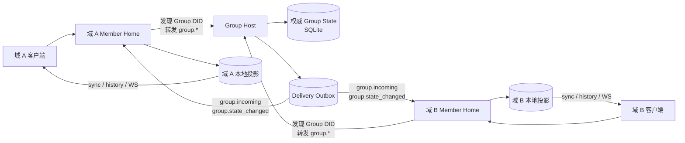
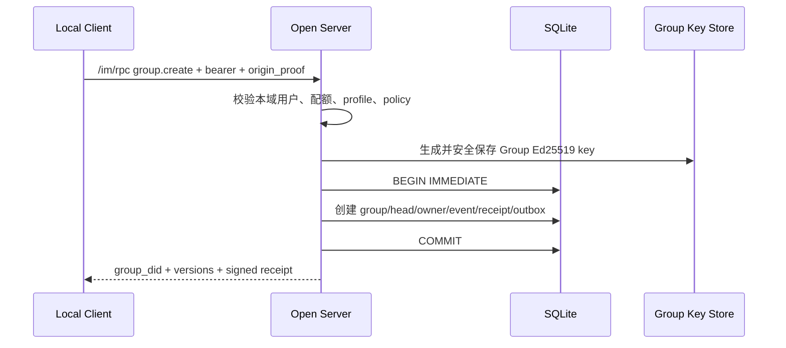
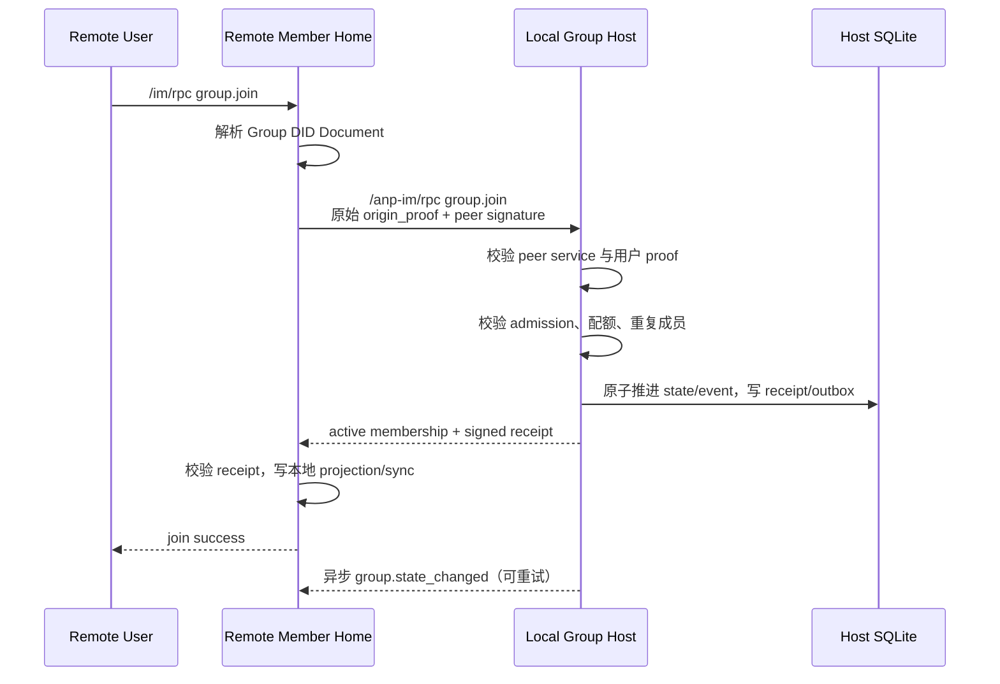
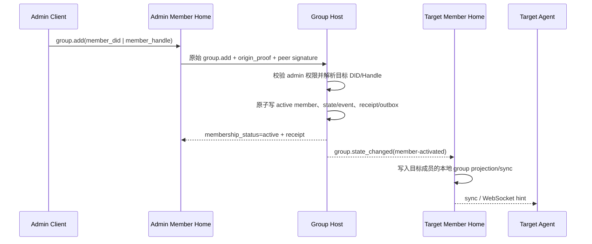
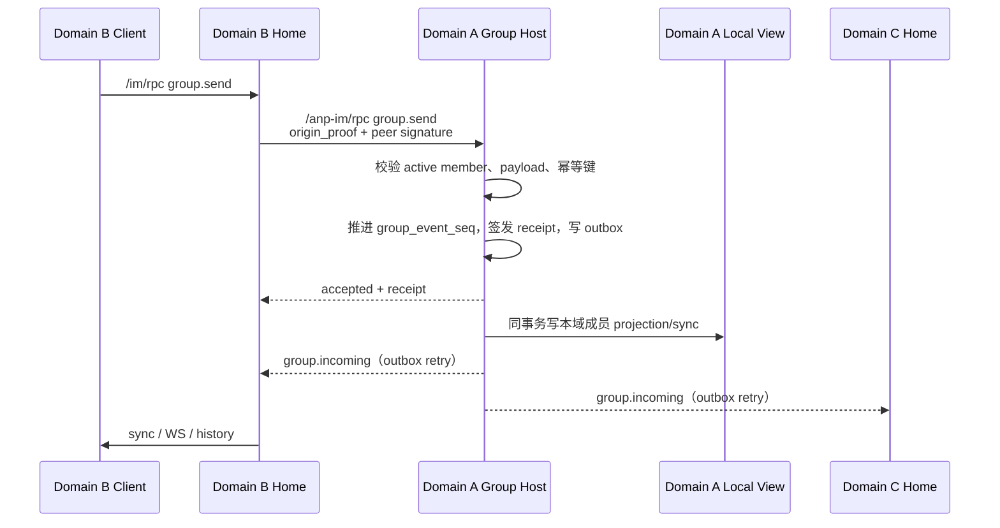

# AWiki Community 群组与跨域互通设计方案

> 状态：设计草案，待评审
>
> 日期：2026-07-16
>
> 目标版本：Community Group v1
>
> 规范基线：ANP P4 v1.1（群组基础语义）与 ANP P8（联邦与跨域）
>
> 本文只描述方案，不代表当前版本已经实现，也不包含代码变更。

## 1. 结论摘要

AWiki Open Server 应在单进程、SQLite、小规模自托管的前提下，提供完整可用的基础群组能力，而不是继续只支持“加入预置群”。基础能力包括：

- 本域用户创建和管理由本服务托管的群组；
- `owner / admin / member` 固定角色与基础权限控制；
- 本域和跨域用户加入、退出、发消息及接收群状态变化；
- 通过 Group DID 定位唯一 Group Host；
- 通过 DID Document、用户 `origin_proof`、服务间 HTTP Signature 和 Group DID 签名回执建立跨域信任；
- 通过 SQLite durable outbox 实现跨域消息和状态通知的可重试投递；
- 为本域客户端保留 `group.list`、`group.list_members`、`group.list_messages`、sync、read-state 和 WebSocket 本地视图；
- 对旧 User Service 群组接口提供可选兼容 façade，但不再维护第二套群组权威数据。

本文不设计邀请子协议。产品界面的“邀请成员”只是 `group.add` 的交互名称：有权限成员直接添加目标 Agent，Group Host 接受后目标立即成为 `active`，没有 token、join code、邀请对象或接受邀请步骤。

核心架构决策是：**每个群只有一个 Group Host，Group Host 是群状态、成员关系、事件顺序和群回执的唯一权威；成员所在域只保存本地投影。**

跨域互通采用 DID 发现后的服务直连，不建设商业版的 federation relay、全局路由平台或多区域复制系统。基础群能力属于开源版；商业版差异应主要体现在容量、高可用、E2EE、复杂治理、审计和运维能力，而不是阻断小规模用户的基本互通。

## 2. 背景与范围变更

本设计启动前的 Community MVP 曾把群创建和管理列为 `not_supported`，只实现一个预置群的参与者子集。当时的代码和文档边界包括：

- `group.create`、`group.add`、`group.remove`、`group.update_profile`、`group.update_policy` 返回 `not_supported`；
- capability 中 `group_participant.management = false`；
- `/anp-im/rpc` 只公开 `group.get_info` 和 `group.join`，没有公开跨域 `group.send`、`group.leave` 或群状态通知；
- `groups` 表只有基础资料和加入模式，没有 Group Host、权威 head、DID key、状态版本或 durable delivery；
- `group_members` 只保存当前成员行，没有完整成员状态历史；
- `group_messages.server_seq` 当前是全局消息序号，不是严格的群内事件序号；
- 群消息只写本机成员视图，没有跨域成员 fanout；
- 默认启动时只创建 `did:wba:<domain>:groups:open` 预置群。

本方案是对上述历史边界的有意调整。当前实现、`AGENTS.md`、`require.md`、README、capability 和测试门禁必须以 Community Group v1 为准；旧 participant-only 状态仅作为 migration 输入保留，不再是产品能力声明。

## 3. 产品目标

### 3.1 必须达成

1. 本域注册用户可以创建普通明文群。
2. 群 owner/admin 可以查看和修改群资料、准入策略、添加成员和移除成员。
3. 本域用户可以加入本域或远端域托管的群。
4. 远端域用户可以加入本服务托管的群。
5. 群内本域与跨域成员可以双向发送和接收消息。
6. 群成员变化、资料变化和策略变化可以同步到其他域成员的 Home Server。
7. 服务重启后，尚未完成的跨域投递可以继续重试。
8. 同一请求重放不会重复建群、重复入群、重复写消息或重复生成权威事件。
9. 当前 Rust CLI、AWiki Me 和兼容客户端可以继续通过稳定方法名接入。
10. 所有本域能力都由本服务本地实现，不把 `awiki.info`、商业 User Service 或商业 Message Service 当作实现后端或失败回退；按目标 DID 发现并调用 `awiki.info` 上的远端 Group Host 属于标准跨域互通，不属于代理依赖。

### 3.2 明确不做

- 不支持大规模群、热点群或高并发 fanout；
- 不支持多进程写入、集群、跨节点锁、Redis、Kafka、PostgreSQL 或分布式事务；
- 不支持多区域复制、任意多跳 relay、全局 federation routing table；
- 不支持群 E2EE、MLS、设备级成员关系或设备级投递；
- 不支持复杂审批流、自定义角色、机器人审核、内容审核工作流；
- 不支持在线无停机 schema migration 或 HA failover；
- 不支持跨域群附件的完整 access-grant/relay 流程；
- 不承诺商业服务的容量、延迟、可用性或留存 SLA；
- 不允许远端匿名用户在本服务创建群；
- 不允许通过公开 API 读取私有群成员列表、消息历史或本域 sync/read-state。

## 4. 术语

| 术语 | 含义 |
| --- | --- |
| Group Host | 托管某个 Group DID 的服务，是群状态和事件顺序的唯一权威 |
| Member Home | 某个成员 DID 所属的 Home Server，负责客户端入口、本地投影、sync 和 WebSocket |
| Hosted Group | Group Host 位于当前 Open Server 的群 |
| Remote Group | Group Host 位于其他域的群 |
| Authoritative State | Group Host 保存并签名的群资料、策略、成员和事件 head |
| Local Projection | Member Home 为本域用户保存的群快照、消息和成员视图，不具备权威写权限 |
| Group Receipt | Group Host 对已接受群操作及其顺序位置签发的 Group DID 级证明 |
| Peer Auth | 服务之间通过 RFC 9421 HTTP Signature、Content-Digest 和 service DID 完成的 hop 认证 |
| Origin Proof | 用户 DID 对原始 `meta + body` 的业务授权证明，跨域转发不得改写 |
| 跨域互通 | 通过 DID 发现直接调用目标服务；不等于通用 federation relay 平台 |

## 5. 设计原则

### 5.1 单一权威

群 DID 所在域决定 Group Host。所有改变群状态的操作和群消息最终都必须由 Group Host 接受并排序。Member Home 不得自行把远端用户加入群，也不得自行生成权威 `group_state_version` 或 `group_event_seq`。

### 5.2 协议兼容优先

标准面以 `anp.group.base.v1` 和 Message Service 当前方法名为准。旧 User Service 接口只作为形状适配层，不形成新的领域模型。

### 5.3 基础能力开源，规模能力分层

开源版可以完整完成小群闭环，但用硬限制保护单机资源。商业版差异包括大规模 fanout、集群、高可用、E2EE、高级治理、搜索、审计和运营能力。

### 5.4 权威写入与投递解耦

Group Host 在 SQLite 事务中完成状态推进、事件落库、回执和 outbox 后即可返回 accepted。跨域 fanout 在事务后异步执行，远端暂时不可用不回滚已经接受的群事件。

### 5.5 至少一次投递，接收端幂等

Community 版不尝试实现分布式 exactly-once。跨域通知采用 at-least-once，接收端使用稳定事件标识去重。

### 5.6 公网默认 fail closed

跨域状态改变和消息必须同时满足用户 origin proof 与服务间 peer auth。开发环境的 unsigned peer 开关不得成为公网兼容路径。

## 6. 总体架构



同一个 `awiki-open-server` 进程同时承担三种逻辑角色：

| 逻辑角色 | 职责 |
| --- | --- |
| Group Host | 处理本服务托管群的 create/join/add/remove/leave/update/send，维护权威状态并签发 receipt |
| Member Home | 接收本域客户端调用；远端群操作转发到 Group Host；保存本域用户的投影、sync 和已读状态 |
| User Compatibility | 适配旧 `/group/rpc` 请求形状，调用同一个群组领域服务，不直接读写另一套群表 |

## 7. 服务边界

### 7.1 Group Host 负责

- 创建 Group DID 和群级 Ed25519 key；
- 发布 Group DID Document；
- 保存权威 profile、policy、成员状态和 group head；
- 校验 actor 身份、成员状态、角色和策略；
- 推进 `group_state_version` 与 `group_event_seq`；
- 生成并签名 `group_receipt`；
- 写入群事件和消息；
- 生成 local sync event 与跨域 delivery outbox；
- 对失败投递重试并记录最终失败。

### 7.2 Member Home 负责

- 使用本域 bearer access token 验证客户端身份；该认证凭据与群入群流程无关；
- 保留客户端提供的 origin proof；
- 解析 Group DID Document 并发现 Group Host endpoint；
- 以本域 service DID 对转发请求做 peer signature；
- 校验远端 Group Host 响应和 `group_receipt`；
- 接收 `group.incoming` 与 `group.state_changed`；
- 保存本域用户可见的群投影、消息、sync event 和 read state；
- 通过 WebSocket 向在线客户端发送 hint。

### 7.3 User Compatibility 负责

- 兼容旧客户端的字段名和返回外形；
- 把旧 `create/update/join/kick_member/post_message` 映射为标准群命令；
- 把本地 group projection 映射为旧 User Service 响应；
- 在兼容模式未启用时明确返回 `not_supported`；
- 不持有群私钥，不推进群状态，不拥有单独的群成员表。

## 8. Group DID 与群级身份

### 8.1 DID 生成

新群推荐使用不可变随机标识，不把可修改的展示名作为身份的一部分：

```text
did:wba:<domain>:groups:<uuid-or-ulid>:e1_<public-key-fingerprint>
```

示例：

```text
did:wba:community.example.com:groups:01JXYZ...:e1_z6Mk...
```

创建流程先生成 Ed25519 key，再生成包含公钥 fingerprint 的 Group DID。`display_name`、slug 和 avatar 都属于 `group_profile`，修改它们不会改变 Group DID。

### 8.2 DID Document

每个本地托管群必须能通过 DID WBA 路径解析。文档至少包含：

- `id = group_did`；
- 群级 `verificationMethod`；
- `authentication` 与 `assertionMethod`；
- 唯一 `ANPMessageService`；
- `serviceEndpoint = AWIKI_PUBLIC_BASE_URL + AWIKI_ANP_PUBLIC_RPC_PATH`；
- `serviceDid = AWIKI_SERVICE_DID`；
- `profiles` 包含 `anp.group.base.v1`；
- Group DID Document 自身的 DataIntegrity proof。

### 8.3 私钥存储

Community 版不引入 KMS。推荐把每个群的 PKCS#8 PEM 保存到：

```text
<AWIKI_DATA_DIR>/group-keys/<group-id>.pem
```

要求：

- 文件权限为 `0600`；
- 目录权限为 `0700`；
- SQLite 只保存 key reference 和公开 DID Document，不保存明文 private key；
- 数据库、对象目录和 `group-keys` 必须作为同一备份单元；
- 日志、错误响应、sync payload 和测试 fixture 不得包含 private key；
- v1 不实现在线 key rotation，密钥丢失时不能继续签发群级回执。

### 8.4 Group Receipt

所有状态改变和 `group.send` 成功响应应包含：

```json
{
  "receipt_type": "group-operation-accepted",
  "group_did": "did:wba:community.example.com:groups:...",
  "group_state_version": "3",
  "group_event_seq": "18",
  "subject_method": "group.add",
  "operation_id": "op-...",
  "actor_did": "did:wba:remote.example:users:alice:e1_...",
  "accepted_at": "2026-07-16T10:00:00Z",
  "payload_digest": "...",
  "proof": {
    "type": "DataIntegrityProof",
    "cryptosuite": "eddsa-jcs-2022",
    "proofPurpose": "assertionMethod",
    "verificationMethod": "<group_did>#key-1",
    "proofValue": "z..."
  }
}
```

消息类 receipt 使用 `group-message-accepted`，并包含 `message_id`。Member Home 收到远端响应或通知时必须校验 receipt 与 group DID、operation、message、state version、event sequence 和 payload digest 的绑定。

## 9. 权威状态与本地投影

### 9.1 权威表族

以下是概念模型，字段名可在实现阶段按现有 SQLite 风格调整。

| 表 | 关键内容 | 权威性 |
| --- | --- | --- |
| `hosted_groups` | group DID、host service DID、profile、policy、state version、event seq、creator | Group Host 权威 |
| `hosted_group_members` | member DID、可选 handle/binding generation、home service DID、role、status、join/end 时间 | Group Host 权威 |
| `hosted_group_events` | 群内有序控制事件和消息事件、payload digest、receipt | Group Host 权威、append-only |
| `hosted_group_messages` | message ID、sender、body、content type、对应 event seq | Group Host 权威 |
| `group_operations` | operation ID、method、payload digest、结果 | 幂等记录 |
| `group_did_documents` | DID Document、key reference、document version | Group Host 权威 |
| `group_delivery_outbox` | event、target DID、endpoint、状态、重试时间、错误摘要 | durable delivery |

### 9.2 Member Home 投影表族

| 表 | 关键内容 |
| --- | --- |
| `group_views` | owner DID、group DID、host service DID、profile/policy snapshot、最新 state/event seq、成员自身角色和状态 |
| `group_member_views` | owner DID 可见的成员 snapshot 与版本 |
| `group_message_views` | owner DID 可见的群消息或系统事件、group event seq、receipt |
| `sync_events` | 账号级可靠增量；继续复用现有表 |
| `read_states` | group thread 本地已读水位；继续复用现有表 |
| `inbound_peer_events` | source service DID、group DID、event seq、target DID，用于通知幂等 |

权威表与投影表必须在命名和 repository API 上分开，防止远端通知被误当成 Group Host 写入。

为支持消息类跨域通知重试，Group Host 需要在权威 event/outbox 中保留生成 `group.incoming` 所需的 canonical `meta/auth/body`。其中 `auth.origin_proof` 属于受保护协议证据：只能随对应事件生命周期持久化和转发，不得进入普通日志、指标、管理员列表或错误响应。

### 9.3 成员模型

v1 支持固定角色：

```text
owner > admin > member
```

成员状态：

```text
active | left | removed
```

成员退出或被移除后保留 tombstone 和历史事件，不直接删除记录。授权只接受 `status = active`。

按照 ANP P4 v1.1 最小互通要求，Community Group v1 必须同时支持：

- DID-only membership：成员键为 `(group_did, agent_did)`；
- Handle-backed membership：成员键为 `(group_did, member_handle)`，同时保存当前 `agent_did` 与 `handle_binding_generation`；
- `group.rebind_member`：Handle 保持 active、底层 DID 变化时，由新 DID 携带新 origin proof 和严格递增的 binding generation 发起原子换绑。

`group.rebind_member` 不创建新成员、不改变角色、不恢复已 left/removed 的成员，也不得重写历史消息、事件或 receipt。DID-only 成员不能通过该方法获得连续性。

### 9.4 群状态版本与事件序号

- `group_state_version`：只在 profile、policy、成员或群生命周期变化时递增；
- `group_event_seq`：每个成功控制操作和每条群消息都递增；
- `group.send` 引用当前 state version，但只推进 event seq；
- 两者在协议上都是十进制字符串；
- SQLite 内部可以使用 integer，但不得把账号级 `sync_events.event_seq` 与群内 event seq 混用。

## 10. 群策略与权限

### 10.1 标准策略

```json
{
  "message_security_profile": "transport-protected",
  "bootstrap_security_profile": "transport-protected",
  "admission_mode": "open-join",
  "permissions": {
    "send": "member",
    "add": "admin",
    "remove": "admin",
    "update_profile": "admin",
    "update_policy": "owner"
  },
  "attachments_allowed": false,
  "max_members": "100"
}
```

Community v1 只允许：

- `message_security_profile = transport-protected`；
- `bootstrap_security_profile = transport-protected`；
- `admission_mode = open-join | admin-add`；
- `max_members` 不得超过服务端硬上限；
- `permissions` 只能使用标准五个键和标准三种角色；
- 不允许通过 policy 开启 E2EE 或绕过服务端硬限制。

### 10.2 权限矩阵

| 操作 | non-member | member | admin | owner |
| --- | ---: | ---: | ---: | ---: |
| `group.get_info` 最小公开资料 | 按 discoverability | 是 | 是 | 是 |
| `group.join` | 仅 `open-join` | 不适用 | 不适用 | 不适用 |
| `group.send` | 否 | 是 | 是 | 是 |
| `group.add` | 否 | 否 | 是 | 是 |
| `group.remove` | 否 | 否 | 是 | 是 |
| `group.update_profile` | 否 | 否 | 是 | 是 |
| `group.update_policy` | 否 | 否 | 否 | 是 |
| `group.leave` | 否 | 是 | 是 | 是 |
| `group.rebind_member` | 仅符合换绑条件的新 DID | 不适用 | 不适用 | 不适用 |

附加规则：

- creator 创建后立即成为 active owner；
- `group.add` 的缺省目标角色是 member；显式角色只能是 owner/admin/member；
- `group.add/remove/send/update_*` 的授权只按当前 `group_policy.permissions.*` 和固定角色层级判断，不增加未声明的角色例外；
- 主动离群使用 `group.leave`，移除当前 active 成员使用 `group.remove`；
- `removed` 或 `left` 成员重新加入时生成新的状态事件，但历史不改写；
- custom role、owner 自动继承和复杂角色变更不属于 v1 标准面；
- Handle-backed member 的换绑必须完整执行 WNS 解析、双向绑定、状态和 generation 校验。

### 10.3 标准入群流程

ANP P4 v1.1 的标准入群流程只有两种：

1. `admission_mode = open-join`：目标 Agent 自己调用 `group.join`，成功后立即成为 `active` member。
2. `admission_mode = admin-add`：有 `permissions.add` 权限的现有成员调用 `group.add`，目标 Agent 成功后立即成为 `active` member。

因此，本方案不定义也不实现：

- `invitation` 或 `invitation_id`；
- `group.invite` 或 `group.accept_invite`；
- invite token、join token 或 join code；
- pending membership、申请审批或接受邀请状态。

产品界面中的“邀请成员”必须直接映射为 `group.add(member_did | member_handle)`。目标成员无需再执行接受动作；Group Host 接受并排序后，目标成员资格已经成立。目标成员随后作为 active member 接收标准 `group.state_changed(member-activated)`。

## 11. API 设计

### 11.1 本域客户端入口 `/im/rpc`

| 方法 | Community v1 行为 |
| --- | --- |
| `group.create` | 仅本域用户创建由本服务托管的群 |
| `group.get_info` | 本地群直接读；远端群通过 Group DID 发现后转发 |
| `group.join` | 本地群由 Host 执行；远端群转发到远端 Host |
| `group.add` | 由最终 Group Host 执行 |
| `group.remove` | 由最终 Group Host 执行 |
| `group.leave` | 由最终 Group Host 执行 |
| `group.rebind_member` | 由新 DID 向最终 Group Host 发起 Handle-backed member 凭证换绑 |
| `group.update_profile` | 由最终 Group Host 执行 |
| `group.update_policy` | 由最终 Group Host 执行 |
| `group.send` | 由最终 Group Host 接受、排序和 fanout |
| `group.get` | 只读当前用户的本地 projection |
| `group.list` | 只列当前用户本地 projection 中的群 |
| `group.list_members` | 只读本地成员 projection，不做隐式跨域写 |
| `group.list_messages` | 只读本地消息 projection |

本域调用规则：

- bearer 认证得到的 DID 必须与 `meta.sender_did` 一致；
- 除 `group.get_info` 外，所有状态改变型群操作和 `group.send` 都必须携带 `auth.origin_proof`，本域调用也不例外；
- 跨域调用必须无损转发原始 `auth.origin_proof`；
- 服务端不得代替用户伪造 origin proof；
- bearer/access token 只优化会话认证，不能替代 origin proof；
- 新客户端应始终发送标准 `meta/auth/body/client` envelope。

### 11.2 公共跨域入口 `/anp-im/rpc`

| 方法 | 是否公开 | 认证和限制 |
| --- | ---: | --- |
| `anp.get_capabilities` | 是 | capability contract |
| `group.create` | 是 | peer auth + origin proof；`meta.target.kind=service`；是否允许远端 actor 托管新群由服务创建策略决定 |
| `group.get_info` | 是 | public/listed 可匿名最小读取；private 或扩展字段需调用方身份和 peer auth；按 P4 不强制 origin proof |
| `group.join` | 是 | peer auth + origin proof；目标群必须由本服务托管 |
| `group.add` | 是 | peer auth + origin proof + role policy |
| `group.remove` | 是 | peer auth + origin proof + role policy |
| `group.leave` | 是 | peer auth + origin proof |
| `group.rebind_member` | 是 | peer auth + 新 DID origin proof + WNS binding/generation 校验 |
| `group.update_profile` | 是 | peer auth + origin proof + role policy |
| `group.update_policy` | 是 | peer auth + origin proof + owner policy |
| `group.send` | 是 | peer auth + origin proof + active membership |
| `group.incoming` | 是 | 仅 peer auth；目标成员必须属于本域；用于远端 Host 下行 |
| `group.state_changed` | 是 | 仅 peer auth；目标成员必须属于本域；用于远端 Host 下行 |
| `group.list*` / sync / read-state | 否 | local-only，返回 method not found/not supported |

`group.create` 是 P4 标准方法，因此公共入口必须能够解析和校验其标准 envelope，不能返回 method not found。Community 部署仍可通过 `AWIKI_GROUP_REMOTE_CREATE_POLICY=local-only` 默认拒绝为远端 actor 托管新群，但应返回稳定的策略/配额错误；显式设置为 `allow-authenticated` 后，才允许通过 peer auth 与 origin proof 的远端 actor 创建本服务托管群。

公开入口必须区分两类请求：

1. **Host command**：远端 Member Home 把用户原始 `group.*` 请求转发给本地 Group Host。
2. **Member delivery**：远端 Group Host 把 `group.incoming` 或 `group.state_changed` 投递给本地 Member Home。

两类请求都要求 peer auth，但业务校验不同。`group.incoming` 还必须携带并保留原始消息 `auth.origin_proof`；`group.state_changed` 必须携带 Group Receipt。

### 11.3 可选 User Service 兼容入口

建议在兼容模式提供同一 handler 的两个路径：

```text
POST /group/rpc
POST /user-service/group/rpc
```

推荐映射：

| 旧方法 | 内部标准能力 |
| --- | --- |
| `create` | `group.create` |
| `get` | `group.get` |
| `update` | 同一事务内应用 profile/policy patch，再产生标准事件 |
| `join` | `group.join`；只适用于 `open-join`，不接收任何 code/token |
| `leave` | `group.leave` |
| `kick_member` | `group.remove` |
| `list_members` | `group.list_members` projection |
| `post_message` | `group.send` |
| `list_messages` | `group.list_messages` projection |
| `refresh_join_code` / `get_join_code` | 明确 `not_supported`；ANP P4 无对应对象或方法 |
| `set_join_enabled` | 映射为 owner 的 `group.update_policy`，在 `open-join` 与 `admin-add` 之间切换 |

兼容 façade 只转换字段和错误，不直接写表。它不得为了兼容旧接口重新引入 join code、token、pending membership 或第二套入群状态，也不得用本地 bearer token 代替标准 origin proof；旧客户端未提供 proof 时，状态改变和发消息请求必须明确失败。若旧接口与标准群策略冲突，以 Group Host 权威策略为准。

### 11.4 Capability

实现完成后应把 capability 从 participant-only 调整为：

```json
{
  "features": {
    "cross_domain_group": {
      "enabled": true,
      "mode": "did_discovery_group_host"
    },
    "group_participant": {
      "enabled": true,
      "management": true,
      "join_modes": ["open-join", "admin-add"],
      "max_members": "100"
    }
  },
  "disabled_features": {
    "group_e2ee": "not_supported_in_community_v1",
    "large_group_fanout": "commercial",
    "group_ha": "commercial",
    "federation_relay": "commercial"
  }
}
```

不能只把 `management` 改成 `true`；必须在真实跨域 Gate 通过后再宣告 `cross_domain_group.enabled=true`。

### 11.5 P4 v1.1 标准面约束

Community Group v1 的协议面应以 P4 v1.1 最小互通方法为准：

```text
group.create
group.get_info
group.join
group.add
group.remove
group.leave
group.update_profile
group.update_policy
group.send
group.rebind_member
```

除方法名外，完成声明还必须覆盖 P4 v1.1 的其余最小互通项：Group DID、state version、event sequence、DID-only/Handle-backed 两种成员模式、三种标准角色、三种标准成员状态、`member-credential-rebound` 事件、三种最低内容类型和安全传输模式。

所有标准请求还必须满足统一 envelope 约束：`meta.profile=anp.group.base.v1`、普通群使用 `meta.security_profile=transport-protected`、`group.create` 的 target 是 service DID，其余既有群操作的 target 是 Group DID。`group.incoming` 与 `group.state_changed` 必须作为 JSON-RPC Notification 使用，不携带请求 `id`。

本方案不新增 `group.invite`、`group.accept_invite`、`group.archive`、`group.update_member_role` 或其它私有 wire method。群解散、角色迁移、审批流等若未来需要，应先进入 ANP 协议评审；在此之前不能成为 Community v1 的隐藏扩展。

## 12. 核心流程

### 12.1 创建本地群



事务结果：

- `group_state_version = "1"`；
- `group_event_seq = "1"`；
- creator 是 active owner；
- 可选 `creator_handle` 必须通过 WNS active 状态与双向绑定校验，并保存 binding generation；
- 每个可选 `initial_members` 条目必须恰好提供 `member_did` 或 `member_handle`，缺省角色为 member；
- `group.create` 事件和本地 sync event 已落库；
- DID Document 立即可由本服务解析；
- 初始成员的远端通知通过 outbox 异步执行。

若 key 文件成功但 SQLite 事务失败，应删除未引用 key；若事务成功后 key 文件丢失，群进入 `key_unavailable` 管理状态并拒绝新的权威写入，不能静默改用 service key。

### 12.2 远端用户加入本地群



Group Host 不信任请求体中自报的 Home endpoint。它必须从 member DID Document 中选择兼容的 `ANPMessageService`，并记录解析到的 service DID。endpoint 可以缓存，但投递失败时应重新解析。

标准 `group.join.body` 只允许可选的 `member_handle` 与 `reason_text`，不接受任何入群凭据字段。没有 `member_handle` 时建立 DID-only membership；存在时必须完成 WNS 验证并建立 Handle-backed membership。

### 12.3 管理员直接添加跨域成员

ANP P4 没有“生成邀请，再等待接受”的中间过程。产品中的邀请操作直接执行 `group.add`：



`group.add` 成功就是目标成员资格成立的最终业务结果。目标 Agent 不需要、也不能再调用 `group.accept_invite`。若目标使用 Handle，Group Host 必须先完成 WNS 归一化、解析、active 状态和双向绑定验证，然后保存 `member_handle`、当前 DID 与 `handle_binding_generation`。

### 12.4 跨域成员向群发消息



成功语义：

- Group Host 事务提交即为最终 accepted；
- 响应不等待所有成员收到消息；
- `group_state_version` 不变；
- `group_event_seq` 增加；
- 每个远端目标成员有独立 outbox 记录；
- 本域成员投影与权威写入在同一 SQLite 事务内完成；
- 远端 Member Home 接收后在同一事务中写 message view、sync event 和 dedupe record，再发送 WebSocket hint。

### 12.5 群管理操作

`group.add/remove/leave/rebind_member/update_profile/update_policy` 使用同一权威执行模板：

1. 根据 Group DID 判断本服务是否是 Host；
2. 非本地 Host 时发现并转发；
3. Host 校验 hop auth、origin proof、actor membership、role 和 expected state version；
4. 在一个事务内推进 state version 与 event seq；
5. 写 append-only event、最新 snapshot、receipt、local sync 和 remote outbox；
6. 返回权威结果；
7. 异步发送 `group.state_changed`。

其中 `group.rebind_member` 由新 DID 发起，除通用模板外还必须 fresh resolve WNS binding，验证 `previous_member_did`、`new_member_did` 和严格递增的 `handle_binding_generation`，并在同一事务中立即撤销旧 DID 对该成员关系的操作权限。成功后必须生成标准 `group.state_changed` 事件 `member-credential-rebound`，包含 `subject_handle`、旧/新 DID、binding generation 和 `membership_status=active`。

### 12.6 远端通知接收

Member Home 接收 `group.incoming` / `group.state_changed` 时必须：

1. 验证 RFC 9421 HTTP Signature、Content-Digest 和 source service DID；对群通知必须按 P8 使用 `body.group_did` 作为 caller anchor，不能从原始消息发送者 `meta.sender_did` 推导调用服务；
2. 验证目标 DID 是本域 active user/agent；
3. 解析 Group DID Document，确认签名服务与 Group Host service 相符；
4. 校验 Group Receipt proof、payload digest、state version 与 event seq；
5. 对消息通知继续校验原始 origin proof；
6. 使用 `(source_service_did, group_did, group_event_seq, target_did, method)` 去重；
7. 拒绝低于当前已接受序号且内容冲突的事件；
8. 原子写入 projection、sync event 和 dedupe record；
9. 提交后发送 WebSocket hint。

若收到序号跳跃，v1 可以先接受当前消息并记录 `projection_gap=true`，同时触发受限修复。不能把乱序通知直接用于降低已有 state version。

## 13. 一致性、并发与幂等

### 13.1 Host 事务

每个权威操作使用 `BEGIN IMMEDIATE`：

1. 读取 group head；
2. 校验群状态和 actor 权限；
3. 校验 `expected_group_state_version`；
4. 查询幂等记录；
5. 计算新 state/event 序号；
6. 更新 snapshot/head；
7. 写 event/message/receipt；
8. 写 local projection/sync；
9. 写 remote outbox；
10. commit。

单进程内可以增加 keyed `asyncio.Lock` 减少 SQLite busy 冲突，但正确性必须来自 SQLite 事务和唯一约束，不能依赖进程内锁。

### 13.2 幂等键

| 操作 | 幂等键 |
| --- | --- |
| 状态改变 | `(sender_did, group_did, method, operation_id)` |
| 群消息 | 先使用状态改变幂等键，并进一步以 `(sender_did, group_did, message_id)` 去重 |
| 远端通知 | `(source_service_did, group_did, event_seq, target_did, method)` |
| Outbox | `(event_id, target_did, notification_method)` |

同一幂等键、相同 canonical payload 返回原结果并标记 `idempotent_replay=true`。同一键但 payload、actor、target、content type 或 operation 不同，返回稳定 conflict，不得覆盖旧记录。

### 13.3 顺序

- 同一群所有权威事件严格按 `group_event_seq` 排序；
- 不同群之间不保证全局顺序；
- 账号 `sync_events.event_seq` 只表示某个本地用户的 projection 顺序；
- WebSocket 只作为 hint，不推进可靠 checkpoint；
- 客户端断线后使用 `sync.delta` 和 `sync.thread_after` 修复本地投影。

## 14. 跨域投递与失败处理

### 14.1 Durable Outbox

建议字段：

```text
delivery_id
group_did
group_event_seq
notification_method
target_did
target_service_did
target_endpoint
payload_json
payload_digest
status = pending | delivering | delivered | dead
attempt_count
next_attempt_at
last_http_status
last_error_code
created_at
delivered_at
```

worker 与 API 同进程运行。启动时扫描 `pending` 和超时的 `delivering` 记录。每次请求重新生成当前 HTTP Signature，但业务 payload 与 digest 保持稳定。

`delivery_id`、attempt number、trace 和 route hint 都是实现内部字段，不得写入标准群业务对象或替代原始 `operation_id/message_id`。跨域重试必须保持原始 method、meta、body、operation ID、message ID 和 origin proof 语义不变。

Outbox recipient set 必须在权威事务内按“事件发生时的成员状态”固化，不能在 worker 执行时重新用最新成员表计算：

- `group.send` 投递给该事件被接受时的 active members；
- `group.join/add` 投递给变更后的 active members，并确保新成员收到自己的激活事件；
- `group.leave/remove` 的标准 `group.state_changed` 只投递给变更后的 active members；离开或被移除的对象不再是群内通知接收者；
- `group.rebind_member` 投递给变更后的 active members，并以新 DID 作为该成员当前通知目标；
- profile 和 policy 事件投递给事件发生时的 active members。

worker 必须对每个 `(group_did, target_did)` delivery stream 保持 FIFO：只有更早的 pending/delivering 事件完成或进入 dead 后，才发送后续事件。不同目标成员和不同群之间可以并发。这样既允许小规模并行，也避免同一成员先收到 remove、后收到更早 message 的常态乱序。

### 14.2 推荐重试策略

```text
立即、30 秒、2 分钟、10 分钟、1 小时、6 小时、24 小时，之后每天一次
```

默认最多保留 30 天。下列错误不重试或快速进入 dead：

- Group DID/target DID 永久无效；
- 远端明确返回 proof/signature invalid；
- 目标用户不存在或已撤销；
- 远端 capability 明确不支持群通知；
- payload 与既有幂等事件冲突。

网络超时、HTTP 5xx、429、临时 DNS/TLS 错误和远端 busy 应重试。429/503 的 `Retry-After` 优先于本地退避。

### 14.3 背压

- API 不同步等待 fanout；
- pending outbox 超过硬上限时拒绝新的群消息，返回 `group.delivery_backlog_full`；
- 管理操作可以保留少量独立配额，避免 backlog 时无法更新策略或移除成员；
- worker 并发必须很小，并按目标域限制并发；
- 不在单个请求中并发创建数百个外部连接。

### 14.4 修复边界

Community v1 主要依靠 durable outbox 和接收端幂等完成可靠投递。跨域历史全量回放不是 ANP P4 的基础保证。

ANP P4 不定义跨域历史拉取或标准 repair method，因此 Community v1 不新增私有 `group.events_after` wire API。实现内部可以保留 snapshot/cursor gap 诊断与 dead delivery 管理员重放能力，但它们不能改变标准请求对象，也不能成为基础互通的前置条件。

## 15. 安全设计

### 15.1 两层认证

所有跨域状态改变和消息必须同时验证：

| 层 | 证明内容 | 不能替代 |
| --- | --- | --- |
| `auth.origin_proof` | 用户 DID 确实授权了该业务 `meta + body` | 不能证明当前 HTTP hop 来自哪个服务 |
| Peer HTTP Signature | 当前请求由 source service DID 发出，body 未被篡改 | 不能代替用户业务授权 |

Group Receipt 是第三层结果证明：证明 Group Host 已接受并排序，但也不能替代原始用户签名。

按 ANP P8 校验 peer service DID 时，caller anchor 必须按方法选择：

- `group.create/get_info/join/add/remove/leave/rebind_member/update_profile/update_policy/send` 使用 `meta.sender_did`；
- `group.incoming/state_changed` 使用 `body.group_did`，不能使用原始消息发送者 `meta.sender_did`；
- 从 caller anchor 的 DID Document 选择 `ANPMessageService.serviceDid`，并要求它与外层 HTTP Signature `keyid` 所属 DID 完全一致。

### 15.2 DID 解析与 SSRF

公网 DID/endpoint 发现必须：

- 只允许 HTTPS，开发 resolver map 除外；
- 禁止 loopback、link-local、RFC1918、Unix socket 和云 metadata 地址；
- 限制重定向次数并重新校验每次目标；
- 限制响应大小、连接时间和总超时；
- 校验 DID Document `id` 与请求 DID 一致；
- 只选择声明兼容 profile/security profile 的 `ANPMessageService`；
- 校验 `serviceDid` 与签名主体；
- 使用短 TTL cache，签名失败或 endpoint 失效时强制刷新；
- 不允许请求体覆盖 resolver 结果。

### 15.3 授权与隐私

- private 群匿名 `get_info` 返回 not found 或统一 unauthorized，避免枚举；
- listed/public 匿名响应只含最小 profile 和 member count，不含 roster 或 policy 细节；
- `group.list_members/messages` 永远不出现在 public route；
- 离群/被移除后立即停止授权新请求和新消息投影；
- 历史可见性采用“加入后可见、离开后是否保留本地已收历史”的产品策略，不能通过重新加入自动获得离开期间消息；
- 错误和日志不得包含 access/refresh token、完整 origin proof 或 private key。

### 15.4 防滥用

- 对 create/join/send/resolve 分别限流；
- join 失败按 group + actor DID + source service DID 计数；
- 单域反复投递失败进入短期 circuit breaker；
- display name、description、labels 和 JSON payload 设置长度与深度上限；
- avatar URI 只保存，不由服务端主动抓取；
- operation ID、message ID 和 DID 长度必须有上限；
- 远端来源不得让本服务为任意第三方 URL 发请求。

## 16. 小规模运行边界

以下是建议默认值，不是性能承诺：

| 限制 | 建议默认值 | 目的 |
| --- | ---: | --- |
| 每服务托管群数 | 100 | 限制 key、事件和投递状态规模 |
| 每用户加入群数 | 20 | 延续当前 capability |
| 每群 active 成员 | 100 | 限制单消息 O(n) fanout |
| 每群远端域数量 | 20 | 控制 DNS/TLS 与失败面 |
| 单消息 JSON body | 64 KiB | 控制 SQLite 与签名成本 |
| 单页成员/消息 | 100 | 避免大查询 |
| Outbox pending | 10,000 | 形成明确背压 |
| Outbox worker 并发 | 4 | 适合单进程自托管 |
| 每目标域并发 | 2 | 避免压垮小型 peer |
| DID discovery cache TTL | 5 分钟 | 兼顾变化和网络成本 |
| Delivery retention | 30 天 | 支持长期短暂离线，同时限制磁盘 |

推荐配置项：

```text
AWIKI_GROUPS_ENABLED
AWIKI_GROUP_MAX_HOSTED
AWIKI_GROUP_MAX_JOINED_PER_USER
AWIKI_GROUP_MAX_MEMBERS
AWIKI_GROUP_MAX_REMOTE_DOMAINS
AWIKI_GROUP_MAX_MESSAGE_BYTES
AWIKI_GROUP_OUTBOX_MAX_PENDING
AWIKI_GROUP_OUTBOX_WORKERS
AWIKI_GROUP_OUTBOX_RETENTION_DAYS
AWIKI_GROUP_DISCOVERY_CACHE_TTL_SECONDS
AWIKI_GROUP_LEGACY_USER_API_ENABLED
AWIKI_GROUP_REMOTE_CREATE_POLICY
```

最终 Community release 中 `AWIKI_GROUPS_ENABLED` 应默认为 true；迁移开发期可以暂时通过 feature gate 关闭。硬限制只能在服务端配置范围内下调或谨慎上调，群 policy 不能突破它们。

## 17. 内容类型与附件边界

Community Group v1 必须支持：

- `text/plain`；
- `application/json`；
- `application/anp-attachment-manifest+json`。

`group.send.body` 必须恰好包含 `text`、`payload`、`payload_b64u` 之一，并与 `meta.content_type` 严格绑定；`thread_id`、`reply_to_message_id` 和 `annotations` 只是可选扩展字段。结构化 JSON 与 attachment manifest 必须通过 `payload` 原样承载，不能被静默转换为字符串。

附件 manifest 必须像普通结构化群消息一样由 Group Host 接受、排序并通过 `group.incoming` 无损投影。对象字节本身不通过群消息或跨域服务调用链路转发，而是按照 ANP P7/P8 直接从原始消息发送者 DID 所发现的 Object Service 下载。

Community v1 的附件边界是：

- 不允许 Group Host 盲目 relay 远端对象；
- 不开放跨域任意 upload delegation；
- `attachment.get_download_ticket` 必须路由到原始群消息发送者 DID 所公开的 `ANPMessageService`，不能路由到 Group DID；
- 跨域 Gate 至少验证 manifest 形状、receipt、fanout 和 ticket 路由，不要求把对象字节塞入 ANP RPC body。

## 18. 代码模块规划

实现时应把新领域逻辑从当前较大的 `messaging/core.py` 中拆出，不继续堆入 `services.py`。

建议结构：

```text
src/awiki_open_server/
  messaging/
    groups/
      handlers.py        # JSON-RPC 参数归一化与 surface 路由
      host.py            # Group Host 权威命令
      policy.py          # role/policy/admission 校验
      identity.py        # Group DID、document、receipt
      routing.py         # Group DID/Member DID 服务发现与远端转发
      delivery.py        # outbox、retry、peer notification
      projections.py     # Member Home 本地投影、sync、read-state
      models.py          # 领域对象与 canonical payload
  user_compat/
    groups.py            # 旧 User Service façade
  storage/
    db.py                # schema/migration 入口
  protocol/
    anp_adapter.py       # 继续作为唯一 ANP SDK adapter
```

边界要求：

- `handlers.py` 不包含 SQL；
- `routing.py` 不决定群权限；
- `projections.py` 不修改 hosted authoritative state；
- `user_compat/groups.py` 不重复实现策略；
- 签名、proof 和 DID 解析继续复用 `protocol/anp_adapter.py` 与 service identity 基础设施；
- realtime 只在事务提交后调用。

## 19. 当前数据迁移方案

### 19.1 新表优先

当前 `groups/group_members/group_messages` 的语义过弱，不建议通过持续追加 nullable 列把权威 Host 与远端 projection 混在一起。推荐建立明确的新表族，再迁移现有记录。

### 19.2 现有预置群

`did:wba:<domain>:groups:open` 没有 e1 fingerprint、群私钥和 owner。不能静默把任意现有成员提升为 owner。

推荐策略：

1. 把预置群标记为 `legacy_participant_only`；
2. 保留当前加入、退出、发消息和历史能力；
3. 默认不对它开放管理和跨域 Group Receipt；
4. 管理员可通过一次性离线迁移命令指定 owner 并生成群 key；
5. 新建群全部使用新 Group DID 模型。

若产品希望默认开放群也具备完整权威身份，应创建一个新的 canonical open group，而不是复用旧 DID 并改变其安全语义。

### 19.3 现有成员与消息

- 现有 member row 迁移为 `status=active`、保留已有 role；
- 没有 owner 的 legacy 群不自动补 owner；
- 现有 schema 中若存在 `invite_token` 或 `join_mode=invite_token`，升级时必须丢弃该凭据并把该 legacy 群保持为 participant-only，或由管理员显式改为标准 `open-join` / `admin-add`；不得把旧 token 迁入新协议模型；
- 已删除的历史成员无法恢复，迁移后从当前 active snapshot 开始；
- 现有消息 `server_seq` 可作为初始 `group_event_seq`，序号允许有间隙；
- group head 从该群最大消息 seq 初始化；
- 旧消息没有 Group Receipt，投影中标记 `legacy_unsigned=true`；
- 新旧消息查询保持稳定排序，但只有新事件具备权威 receipt。

### 19.4 升级与回滚

- schema migration 前必须停止服务并备份完整 `AWIKI_DATA_DIR`；
- migration 记录版本和 checksum；
- key 文件生成和数据库引用必须可审计；
- migration 成功后运行 local group、双域 group 和 restart/outbox smoke；
- 回滚只能恢复升级前完整备份，不能只回滚 SQLite 而保留新 key 目录。

## 20. 分阶段实施计划

### Phase 0：范围与契约冻结

- 评审本文；
- 更新 Community MVP 边界；
- 冻结 P4 v1.1 API、默认配额、Handle/WNS 与 legacy compatibility；
- 新增 capability contract 测试，但保持 feature disabled。

### Phase 1：本地域 Group Host

- 新 schema 与 migration；
- Group DID/key/document/receipt；
- create/get_info/join/add/remove/leave/rebind_member/update_profile/update_policy/send；
- DID-only 与 Handle-backed membership；
- role/policy/idempotency/state/event 顺序；
- local projection、sync、read-state、WebSocket；
- 此阶段仍不宣告跨域群可用。

### Phase 2：远端群路由

- 根据 Agent DID、Handle 和 Group DID 发现最终服务；
- 本域 `/im/rpc` 远端转发；
- 保留 origin proof 并增加 service signature；
- 校验远端 Group Receipt；
- 支持本域用户加入和操作远端群。

### Phase 3：跨域成员与 durable fanout

- public host command allowlist；
- public `group.incoming/state_changed`；
- Member Home projection；
- durable outbox、retry、dedupe、backpressure；
- 双域和三域系统测试。

### Phase 4：User Service 兼容

- `/group/rpc` 与 `/user-service/group/rpc` façade；
- 旧字段映射和错误兼容；
- join code 相关 legacy 方法明确返回 `not_supported`，不建立兼容状态；
- Rust CLI 与 AWiki Me contract gate。

### Phase 5：发布门禁与运维

- 配置、部署、备份、容量和故障文档；
- `rwiki.cn` 公网 host + 真实远端 peer 验证；
- capability 从 disabled 切换为 enabled；
- 安全 Review、升级 Review 和最终 full suite。

## 21. 测试与验收

### 21.1 单元测试

- role hierarchy 与 permission matrix；
- admission mode、member cap 和 last-owner 规则；
- state/event version 推进；
- canonical payload digest 和 Group Receipt 签名验证；
- operation/message idempotency 与 conflict；
- 本域 bearer/access token 不得替代状态操作和 `group.send` 的 origin proof；
- DID-only / Handle-backed membership 与 `group.rebind_member` 的 WNS/generation 校验；
- SSRF 与 DID Document 选择规则；
- outbox retry 分类和 backoff。

### 21.2 单服务 ASGI 测试

- 创建、资料修改、策略修改、join/add/remove/leave/rebind/send 全生命周期；
- 非成员、低角色、离群成员和被移除成员拒绝；
- private/listed/public 信息可见性；
- local group list/member/message/sync/read-state/realtime；
- `group.incoming/state_changed` 使用标准 Notification envelope 且没有 JSON-RPC request ID；
- legacy participant-only 群不被意外升级；
- restart 后 group key 与 receipt 仍可用。

### 21.3 协议级双域互通 Gate

域 A 托管群，域 B 托管远端成员：

1. A 创建群；
2. B 用户发现并加入；
3. B 用户发消息，A 用户收到；
4. A 用户发消息，B 用户收到；
5. A owner 更新 profile/policy，B 收到 state change；
6. A admin 通过 `group.add` 直接加入另一个跨域成员，目标无需接受邀请；
7. B 用户离群后不能继续发送；
8. Handle-backed member 可按标准完成 DID rebind，旧 DID 立即失权；
9. 附件 manifest 无损 fanout，ticket 路由锚定原始消息发送者 DID；
10. 两侧 history、sync 和 WebSocket projection 一致；
11. 所有跨域请求同时验证 origin proof 和 peer signature。

该 Gate 可以使用两个独立 Open Server 实例做可重复的故障注入，但不能替代下一节的真实兼容服务 Gate。

### 21.4 本机真实域 CLI 互通发布 Gate

发布前必须使用 Rust CLI 验证 Open Server 与 `awiki.info` 的真实互通。当前工作区采用以下测试对象：

| 角色 | 公共入口 | CLI 隔离单元 | 说明 |
| --- | --- | --- | --- |
| Community 域 | `https://rwiki.cn` | 独立 tenant/workspace 和身份库 | 指向当前 Open Server |
| 兼容服务域 | `https://awiki.info` | 另一个独立 tenant/workspace 和身份库 | User Service、Message Service 与入口代理虽运行在本机，仍视为独立 peer |

测试 CLI 使用 `../awiki-cli-rs2/target/debug/awiki-cli`，也可以使用 `../awiki-cli-rs2/bin/awiki-cli` wrapper。测试前记录 `awiki-cli version`，并分别创建原子 tenant profile：Community tenant 的 `backend_base_url` / `did_host` 必须是 `https://rwiki.cn` / `rwiki.cn`，兼容服务 tenant 必须是 `https://awiki.info` / `awiki.info`。CLI tenant 已按 `~/.awiki-cli/tenants/<name>` 隔离；自动化 Gate 应进一步用不同的 `AWIKI_CLI_WORKSPACE_HOME_DIR` 隔离配置、身份私钥、SQLite、cache 和 runtime 状态，避免 active tenant 或本地投影串线。

这个 Gate 必须满足以下网络约束：

- 两个 CLI workspace 不能都指向 `awiki.info`，否则只能证明商业服务内部互通；
- 所有业务请求必须从公共 HTTPS 域名进入，即使两个服务都在本机，也不能直接调用 `127.0.0.1:<internal-port>`、Unix socket 或进程内 handler；
- 必须从 Agent DID / Group DID 做 DID Document 与 `ANPMessageService` 发现，不能在测试代码里把远端 RPC endpoint 硬编码为内部地址；
- 必须实际校验 origin proof、RFC 9421 peer signature、Content-Digest 和 Group Receipt；不得打开 unsigned peer、固定 resolver map 或其它开发绕过开关；
- ASGI mock、fixture peer 和直接数据库写入只属于较低层测试，不能代替本 Gate；
- 每个方向至少使用两个远端测试身份，分别覆盖 `group.add` 和 `group.join`；测试群必须带 run ID，并由测试环境按数据保留策略清理隔离数据，不能为此新增非标准群删除 wire method。

Gate 必须按两个托管方向各完整执行一次：

**方向 A：群由 Open Server（`rwiki.cn`）托管。**

1. `rwiki.cn` owner 使用 `group create` 创建群，随后用 `group get` 和 `group list` 验证 Group DID、profile、policy 与本地投影；
2. 在 `admin-add` 策略下，owner 使用 `group add --member <awiki.info DID-or-handle>` 直接添加第一个 `awiki.info` 身份；成功后该身份必须立即为 `active`，双方使用 `group members` 可见，期间没有接受动作、token 或 join code；
3. owner 使用 `group update` 修改 profile，并把 admission mode 改为 `open-join`；第二个 `awiki.info` 身份仅使用 `group join --group <group_did>` 加入；
4. 两个域分别使用 `msg send --group <group_did> --client-message-id <unique_id>` 发送消息，双方用 `group messages` 验证同一 message ID、顺序位置、正文和 receipt；
5. 验证跨域成员变化和 profile/policy 更新进入 `awiki.info` 的本地 history、sync/realtime projection；
6. join 身份执行 `group leave` 后立即失去发送权限；owner 对 add 身份执行 `group remove` 后，该身份也立即失去发送权限。

**方向 B：群由兼容服务（`awiki.info`）托管。**

1. `awiki.info` owner 使用相同的 `group create/get/list` 流程创建群；
2. 在 `admin-add` 策略下，owner 通过 `group add` 直接添加一个 `rwiki.cn` 身份，并用两侧 `group members` 验证其立即 active；
3. 通过 `group update` 切换为 `open-join` 后，另一个 `rwiki.cn` 身份使用 `group join` 加入；
4. 两侧使用 `msg send --group` 双向发送，并用 `group messages` 验证 Open Server 能保存远端群投影和 Group Receipt；
5. `awiki.info` owner 更新 profile/policy，Open Server 必须接收对应 `group.state_changed`；
6. 分别执行 `group leave` 和 `group remove`，验证 Open Server 的成员投影、sync、history、realtime 以及后续授权判断一致更新。

两条链路都必须验证请求方向，而不只是最终数据库结果：

```text
rwiki.cn CLI identity
  -> https://rwiki.cn
  -> DID discovery
  -> https://awiki.info/anp-im/rpc

awiki.info CLI identity
  -> https://awiki.info
  -> DID discovery
  -> https://rwiki.cn/anp-im/rpc
```

每次运行生成独立 `run_id`，测试报告至少记录：CLI 版本、方向、公共源/目标域、source/target service DID、Group DID、成员 DID、operation ID、message ID、`group_event_seq`、`group_state_version`、receipt 验证结果、投递/重试结果和关键时间戳。报告不得包含 bearer/access/refresh token、私钥、完整 origin proof、完整 HTTP Signature 或非测试消息正文；proof 与 receipt 只记录算法、key ID、digest/验证结果等可审计摘要。

`group.add` 的验收断言必须明确：Host 返回成功并产生 `member-activated` 后成员资格已经成立。CLI 和服务端均不得生成或等待邀请对象，不得要求目标执行接受命令，也不得接受 invite token、join token 或 join code。

### 21.5 三域 fanout Gate

域 A 托管群，域 B/C 各有成员：

- B 发消息，A/B/C 都出现同一个 message ID、group event seq 和 receipt；
- C 暂时离线时 A/B 正常使用，C 恢复后通过 outbox 收到；
- 重试不会产生重复消息或重复 sync event；
- B 的失败不能阻塞 C 的投递；
- outbox backlog 和 dead delivery 可观测。

### 21.6 安全 Gate

- forged origin proof；
- body 在转发后被改写；
- forged peer service DID/header；
- signature target URI 或 content digest 不匹配；
- group receipt 使用错误 group key；
- actor DID 与 membership 不一致；
- public route 调用 local-only 方法；
- private group 匿名枚举；
- 非 `open-join` 群调用 `group.join`；
- forged/stale Handle binding generation 与旧 DID rebind；
- malicious DID endpoint 指向内网；
- replay、乱序、event conflict 和 stale state version。

### 21.7 完成标准

只有同时满足以下条件，才可在 capability 中声明跨域群可用：

- 本地域完整生命周期通过；
- 双域双向消息通过；
- 三域 fanout 与离线重试通过；
- 服务重启恢复 outbox 通过；
- `rwiki.cn` 与 `awiki.info` 两个托管方向的真实公共 HTTPS/DID/signature/receipt Gate 均通过；
- 至少一个商业 Message Service peer 或独立兼容实现通过互通；当前发布基线由本机 `awiki.info` 兼容服务承担；
- Rust CLI 的 create/get/list/add/join/members/update/send/messages/leave/remove 主流程通过，且 add 流程没有接受、token 或 code 步骤；
- AWiki Me 的 create/join/send/list/leave 主流程通过；
- 公网 route、privacy、SSRF、proof 和 receipt Security Review 无未处理高危问题；
- 文档、capability 和真实实现一致。

## 22. 可观测性与运维

### 22.1 结构化日志

建议字段：

```text
correlation_id
operation_id
message_id
group_did
group_event_seq
source_service_did
target_service_did
target_did
delivery_id
attempt_count
result_code
duration_ms
```

必须脱敏：access/refresh token、origin proof 原文、private key、完整消息正文。

### 22.2 指标

- hosted group 数、active member 数；
- group command success/error/latency；
- message accepted 数；
- outbox pending/delivering/dead；
- delivery retry 次数与 age；
- peer signature/origin proof/receipt 验证失败；
- DID resolution latency/failure/cache hit；
- SQLite busy、transaction duration 和 DB size；
- realtime publish 成功/失败。

### 22.3 Health

`/healthz` 继续只表示进程可用。建议增加受保护的运维状态或诊断输出：

- schema version；
- group key directory 可读写；
- oldest pending delivery age；
- dead delivery count；
- DB size 和 WAL size；
- 最近一次 outbox worker heartbeat。

公开 health 不应暴露 group DID、成员 DID 或 peer 域列表。

## 23. 风险与取舍

| 风险 | 影响 | 缓解 |
| --- | --- | --- |
| SQLite 单写者 | 热点群写入冲突 | 小群硬限制、短事务、BEGIN IMMEDIATE、keyed lock 降冲突 |
| Fanout 为 O(n) | 成员越多写放大越明显 | 100 人硬上限、事务后 outbox、背压 |
| 远端长期离线 | outbox 占用磁盘、投影缺口 | retention、dead 状态、受限 repair 扩展 |
| DID endpoint 变化 | 缓存路由失效 | 短 TTL、失败后重新解析、service DID 校验 |
| Group key 丢失 | 无法签发新 receipt | key 与 DB 一致备份、启动自检、fail closed |
| legacy 群无 owner/key | 无法安全开放管理 | participant-only 保留，一次性显式迁移 |
| 旧客户端没有 origin proof | 无法安全执行群状态改变或发消息 | 明确拒绝写操作；只保留 P4 允许的无 proof 读取，并要求客户端升级为标准 envelope |
| 跨域乱序/重复 | 本地投影错误 | event seq、receipt、dedupe、gap 标记 |
| 接口面扩大 | 公网攻击面增加 | 精确 allowlist、两层认证、SSRF 防护、限流 |
| 与商业实现语义漂移 | 互通失败 | 以 P4/Message Service contract test 和真实 peer Gate 为准 |

## 24. 需要在实现前确认的产品决策

本文给出推荐默认值，以下项目仍建议由产品和协议负责人明确签字：

| 决策 | 推荐选择 |
| --- | --- |
| 远端用户是否可在本服务创建群 | 公共端点识别标准 `group.create`；默认 hosting policy 可限制为本域用户，远端请求返回策略拒绝而不是 method not found |
| 默认成员上限 | 100，服务端可配置但不宣称大群支持 |
| 默认 admission | `open-join`，私有群可选 `admin-add` |
| 是否首版兼容旧 `/group/rpc` | 建议 Phase 4 支持，标准 ANP 仍为权威模型 |
| 旧 join-code API | `refresh_join_code/get_join_code` 明确 `not_supported`；不保存 code/token |
| “邀请成员”产品动作 | 直接调用标准 `group.add`，成功即 active，不存在接受邀请步骤 |
| owner 变更 | P4 v1.1 没有现有成员 role-update 方法；`group.add` 可为新成员指定标准角色，不新增私有 transfer API |
| 离群后本地历史 | 已经投递到本域的历史可保留只读；不再接收新消息，不补离群期间历史 |
| 群解散 | P4 v1.1 未定义，不新增私有 wire method；后续先走协议评审 |
| Handle 连续性 | 按 P4 最小互通要求在 Community v1 支持 DID-only、Handle-backed 和 `group.rebind_member` |
| 跨域附件 | 支持标准 attachment manifest 与 P7/P8 ticket 路由；对象字节不经过 ANP RPC 转发 |
| E2EE | Community Group v1 不支持，保持明确 disabled |

## 25. 最终建议

建议批准以下方向进入后续实施 Plan：

1. 将基础群创建、管理和跨域普通群互通纳入 Community Edition；
2. 采用“唯一 Group Host + Member Home 投影”模型；
3. 严格以 ANP P4 v1.1、P8、Group DID 和 Group Receipt 作为权威协议面，不引入 token/join code 邀请流；
4. 使用 SQLite 权威事务加 durable outbox，而不是同步等待全部 fanout；
5. 把 User Service 群 API 降为兼容 façade，不建立第二套 SoT；
6. 用明确的小规模硬限制保护单机部署；
7. 把 HA、大群、E2EE、复杂治理和 federation relay 保留为商业版能力；
8. 按 Phase 0-5 分步实现，每一阶段都先锁定 contract 和 security gate，再扩大 capability 声明。

该方案能满足“不购买商业版也能自建一个真正可用的小型 AWiki 群组服务”的目标，同时保留与商业 Message Service、User Service 和其他 ANP 域互通的清晰路径。

## 26. 设计依据

本方案基于以下当前实现和相邻契约完成，不以尚未存在的能力作为现状：

- 当前 Open Server：`src/awiki_open_server/messaging/core.py`、`app/routes.py`、`storage/db.py`；
- 当前回归测试：`tests/test_group_participant.py`、`tests/test_messaging_surface.py`、`tests/test_sync_read_state.py`；
- Message Service：`docs/api/ANP-client-server-api-group.md`；
- Message Service：`docs/architecture/group-architecture.md`；
- User Service：`docs/api/group.md`；
- ANP P4 v1.1：`AgentNetworkProtocol/chinese/message/04-群组基础语义.md`；
- ANP P8：`AgentNetworkProtocol/chinese/message/08-联邦与跨域.md`；
- Rust CLI：group wire、lifecycle、local view 与 contract tests。

发生语义冲突时，采用以下优先级：

1. `../anp/AgentNetworkProtocol/chinese/message/04-群组基础语义.md`（P4 v1.1）；
2. `../anp/AgentNetworkProtocol/chinese/message/08-联邦与跨域.md`（P8）；
3. Message Service 当前 API/架构文档与 contract tests；
4. User Service legacy 群 API；
5. Open Server Community Group v1 当前实现与 contract tests。

因此，legacy API 中存在但 P4 未定义的 join code/token 不进入新设计；P4 最小互通要求中的 Handle-backed membership 和 `group.rebind_member` 则不能因 Community 实现较小而省略。相邻仓库文档用于锁定兼容方向，不构成本服务的运行时依赖。实现仍必须完全位于 `awiki-open-server`，并通过独立 Open Server 之间以及 Open Server 与真实兼容 peer 之间的系统测试证明互通。
