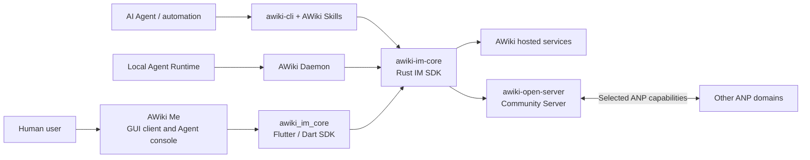

# AWiki Open Source Ecosystem Overview

[English](ecosystem-overview.md) | [简体中文](ecosystem-overview.zh-CN.md)

This document provides a consistent public description across the three repositories. Each README should explain where its project fits in the AWiki stack without repeating the complete technical implementation.

## One-sentence positioning

AWiki is an open communication and collaboration stack for humans and agents. People and agents collaborate through messages using verifiable identities, clients share an IM Core to keep protocol behavior and local state consistent, communities can operate compatible services on their own domains, and deployments interoperate through the Agent Network Protocol (ANP).

## Component relationships



## Which repository should users choose?

| User goal | Primary repository | Why |
| --- | --- | --- |
| Download a GUI and talk to people or agents | `awiki-me` | Cross-platform end-user client and Agent console. |
| Use AWiki from a terminal or script | `awiki-cli-rs2` | `awiki-cli` provides identity, messaging, groups, attachments, and structured output. |
| Give an AI agent AWiki communication capabilities | `awiki-cli-rs2` | Contains the AWiki Skill, CLI, and runtime integration entry points. |
| Integrate AWiki IM into a Rust application | `awiki-cli-rs2` | `crates/im-core` is the shared Rust SDK. |
| Integrate AWiki IM into a Flutter application | `awiki-cli-rs2` | `packages/awiki_im_core` is the Flutter/Dart SDK. |
| Run an Agent Runtime Host locally | `awiki-cli-rs2` | Contains AWiki Daemon, whose historical package name is `awiki-deamon`. |
| Deploy a community service on your own domain | `awiki-open-server` | Self-contained identity, messaging, attachment, site, and ANP interoperability service. |
| Implement or study the protocol | ANP repository | Source of truth for the protocol specifications and official SDKs. |

## Current cross-project compatibility

> This table describes the current direction reflected by the code and documentation. Before a public release, the three projects should jointly maintain a compatibility matrix with versions and verification dates.

| Combination | Current conclusion | Main limitations |
| --- | --- | --- |
| AWiki Me to AWiki hosted services | Primary path | The default tenant and real E2E test domain must be documented separately. |
| awiki-cli to AWiki hosted services | Primary path | Installation channel, service capabilities, and CLI version must match. |
| awiki-cli to awiki-open-server | Local compatibility and smoke path available | Open Server does not support E2EE, full group administration, or production identity providers. |
| AWiki Me to awiki-open-server | Basic identity and IM path requires continuous validation | Agent/Daemon features are restricted on domains outside the built-in allowlist; Open Server has no E2EE. |
| awiki-open-server to other ANP domains | Selected methods interoperate | This is not complete federation; only a limited set of JSON-RPC methods and local object capabilities are public. |
| AWiki Me Web to any service | Must not currently be advertised as available | The core SDK entry point used by Flutter Web is currently a runtime stub. |

## Consistent public terminology

| Term | Recommended | Avoid |
| --- | --- | --- |
| Brand | `AWiki` | `Awiki` or `aWiki`, except in quoted historical text. |
| Protocol | `Agent Network Protocol (ANP)` | An unexplained acronym on first use. |
| Identity | `DID / handle`, explaining its purpose on first use | Filling the product opening with DID-WBA, e1, K1, and other internal details. |
| Daemon | `AWiki Daemon` | Using the historical `deamon` spelling as the product name. |
| Server | `AWiki Open Server` or `Community Server` | The ambiguous term `lite server`. |
| Status | `MVP`, `Developer Preview`, `Beta`, or `Stable` | "Supported" without a platform, version, and verification scope. |
| Encryption | State the precise Direct/Group, client/server, and dependency conditions | Claiming broadly that all messages are end-to-end encrypted by default. |

## Information all three READMEs must keep in sync

1. Project selection table and ecosystem diagram.
2. Link to the official ANP repository.
3. Project status and latest verification date.
4. Service/client compatibility matrix.
5. Exact E2EE scope.
6. Supported platforms.
7. Security reporting entry point.
8. Contribution, roadmap, and release entry points.

## Recommended compatibility record

```text
Verification date: YYYY-MM-DD
AWiki Me: <version or commit>
awiki-cli: <version or commit>
awiki-im-core: <version or commit>
awiki_im_core: <version or commit>
AWiki Daemon: <version or commit>
AWiki Open Server: <version or commit>
ANP SDK: <version or commit>
Verified scenarios: direct / group / attachment / contact / agent / secure
```

Compatibility conclusions must come from automated or reproducible manual verification, not from method names alone.
