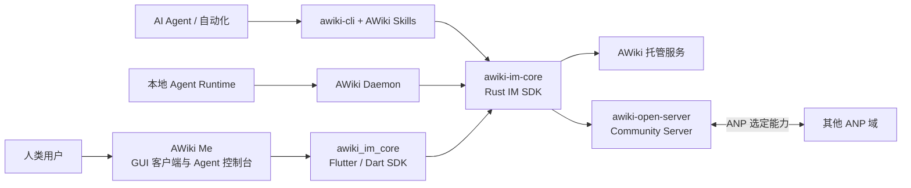

# AWiki 开源生态统一说明

[English](ecosystem-overview.md) | [简体中文](ecosystem-overview.zh-CN.md)

这份文档用于统一三个仓库的对外叙事。每个仓库的 README 都应回答“当前项目在整个 AWiki 栈中的位置”，但不应重复完整技术实现。

## 一句话定位

AWiki 是一套面向人类与智能体的开放通信与协作栈：人和 Agent 使用可验证身份进行消息协作，客户端通过共享 IM Core 保持协议与本地状态一致，社区可运行自己的兼容服务，并通过 Agent Network Protocol（ANP）进行互通。

## 组件关系



## 用户应该进入哪个仓库

| 用户目标 | 首选仓库 | 原因 |
| --- | --- | --- |
| 下载 GUI，与人或 Agent 对话 | `awiki-me` | 面向最终用户的跨平台客户端与 Agent 控制台 |
| 在终端或脚本中使用 AWiki | `awiki-cli-rs2` | `awiki-cli` 提供身份、消息、群组、附件和结构化输出 |
| 让 AI Agent 获得 AWiki 通信能力 | `awiki-cli-rs2` | 仓库内包含 AWiki Skill、CLI 和运行时集成入口 |
| 在 Rust 应用中集成 AWiki IM | `awiki-cli-rs2` | `crates/im-core` 是共享 Rust SDK |
| 在 Flutter 应用中集成 AWiki IM | `awiki-cli-rs2` | `packages/awiki_im_core` 是 Flutter/Dart SDK |
| 在本地运行 Agent Runtime Host | `awiki-cli-rs2` | 仓库内包含 AWiki Daemon（历史包名为 `awiki-deamon`） |
| 在自己的域名部署社区服务 | `awiki-open-server` | 自包含的身份、消息、附件、站点与 ANP 互通服务 |
| 实现或研究协议 | ANP 仓库 | 协议规范与官方 SDK 的事实来源 |

## 当前跨项目兼容性概览

> 本表描述当前代码与文档体现的方向。对外发布前，应由三个项目共同维护一份带版本号和验证日期的兼容矩阵。

| 组合 | 当前结论 | 主要限制 |
| --- | --- | --- |
| AWiki Me ↔ AWiki 托管服务 | 主路径 | 默认租户与真实 E2E 测试域名需要分别说明 |
| awiki-cli ↔ AWiki 托管服务 | 主路径 | 安装 channel、服务能力与 CLI 版本必须匹配 |
| awiki-cli ↔ awiki-open-server | 已有 Community Group v1 与本地兼容路径 | Open Server 不支持 E2EE、大群/复杂治理、HA 和生产身份提供方 |
| AWiki Me ↔ awiki-open-server | 基础身份/IM 路径需持续验证 | 非内置 allowlist 域名上的 Agent/Daemon 功能会受限；Open Server 无 E2EE |
| awiki-open-server ↔ 其他 ANP 域 | Direct 与 Community Group v1 通过 DID discovery 互通 | 不是 federation relay 或 peer-route mesh；只公开文档列出的 ANP 与对象能力 |
| AWiki Me Web ↔ 任意服务 | 当前不应宣称可用 | Flutter Web 使用的核心 SDK入口目前是运行时 stub |

## 对外统一术语

| 术语 | 推荐写法 | 不推荐写法 |
| --- | --- | --- |
| 品牌 | `AWiki` | `Awiki`、`aWiki`（历史文档可保留原文） |
| 协议 | `Agent Network Protocol（ANP）` | 只写缩写而不解释 |
| 身份 | `DID / handle`，首次出现解释用途 | 在产品首屏堆叠 DID-WBA、e1、K1 等内部细节 |
| Daemon | `AWiki Daemon` | 把历史拼写 `deamon` 当作产品名称 |
| 服务端 | `AWiki Open Server` 或 `Community Server` | 模糊的 `lite server` |
| 状态 | `MVP`、`Developer Preview`、`Beta`、`Stable` | “已支持”但不写平台、版本和验证范围 |
| 加密 | 精确写明 Direct/Group、客户端/服务端与依赖条件 | 笼统宣称“所有消息默认端到端加密” |

## 三个 README 都必须同步的信息

1. 项目选择表和生态图；
2. ANP 官方仓库链接；
3. 项目状态和最近验证日期；
4. 服务/客户端兼容矩阵；
5. E2EE 的准确范围；
6. 支持平台；
7. 安全报告入口；
8. 贡献、Roadmap 和 Release 入口。

## 建议的版本兼容记录格式

```text
验证日期：YYYY-MM-DD
AWiki Me：<version or commit>
awiki-cli：<version or commit>
awiki-im-core：<version or commit>
awiki_im_core：<version or commit>
AWiki Daemon：<version or commit>
AWiki Open Server：<version or commit>
ANP SDK：<version or commit>
已验证场景：direct / group / attachment / contact / agent / secure
```

兼容性结论必须来自自动化或可复现的人工验证，不应仅根据接口名称推断。
